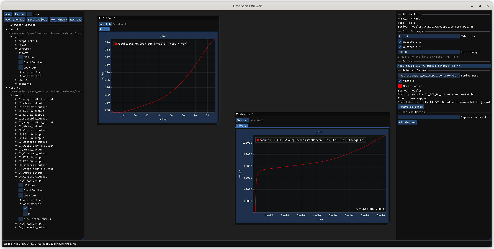

# Time Series Viewer

Time Series Viewer is a desktop app for exploring CSV and SQLite data in a focused, visual workflow.

It is built for quick inspection:

- Browse parameters from the left panel.
- Add series to plots with a click.
- Compare multiple sources side by side.
- Toggle autoscaling, fixed ranges, visibility, and colors from the active plot tools.
- Save a workspace and reopen it later.

## Start here

- [Documentation index](docs/README.md)
- [Product breakdown](product-breakdown/README.md)

## What to expect

The interface is designed for day-to-day analysis of live or file-backed data. Open a source, pick the variables you want, and refine the plot without leaving the app.

If you are new here, start with the docs index for setup and usage guidance, then return to the screenshot above as a quick map of the main layout.
